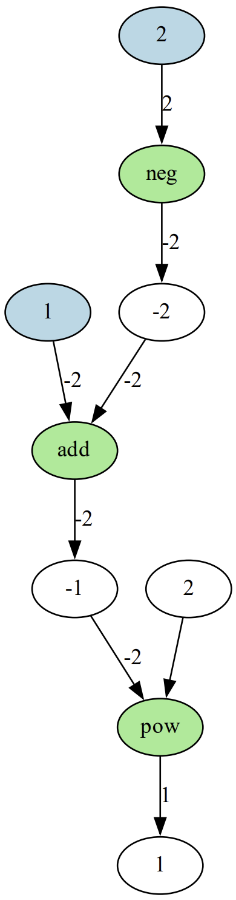

# GraDino
an autograd package in python. GraDino variables can be used in lists, tuples or even `numpy` arrays!
gradients are calculated using backpropagation. examples of linear regression and XOR neural network is in the `nn.ipynb` notebook.
## Basic Usage
a `Variable` can be defined using a `float` or `int` datatype. every operation on a `Variable` results in another `Variable`. finally when `backward` method is called on a `Variable`. every `Variable`'s gradient is calculated using backpropagation and stored in `grad` property.
```python
import grad
from grad.variable import Variable as vn

x = vn(1.0, requires_grad=True)
y = vn(2.0, requires_grad=True)
z = (x - y) ** 2
z.backward()
print(x.grad, y.grad) # -2.0 2.0
````

## Numpy Arrays
an autograding array can be defined using `array` function in the module. it can work with lists and numpy arryas. to extract the gradients we can use `array_grad` function to extract the gradients.
```python
import grad
from grad import variable as vp

x = vp.array(np.random.randn(3, 10))
y = vp.array(np.random.randn(10, 3))
z = np.mean((x - y.T) ** 2)
z.backward()
print(vp.array_grad(x))
print(vp.array_grad(y))
```
## Gradient Calculation Techniques
* if we want to define a variable where there is no need for backpropagation we can set `requires_grad` attribute to `False`.
* to zero the calculated gradients after applying optimization in each iteration, `zero_grad` method should be called on each `Variable`. to apply this in an array we can use `array_zero_grad` function.
* to disable computation graph during optimization, `with vp.no_grad():` can be used.
## Computational Graph Drawing
to draw the computational graph of a `Variable` we can use `draw_graph` function. it uses `graphviz` library to draw the graph. the graph is returned as a `graphviz.Digraph` object.
```python
import grad
from grad import variable as vp

x = vp(1.0, requires_grad=True)
y = vp(2.0, requires_grad=True)
z = (x - y) ** 2
z.backward()
g = z.draw_graph()
g.view()
```
